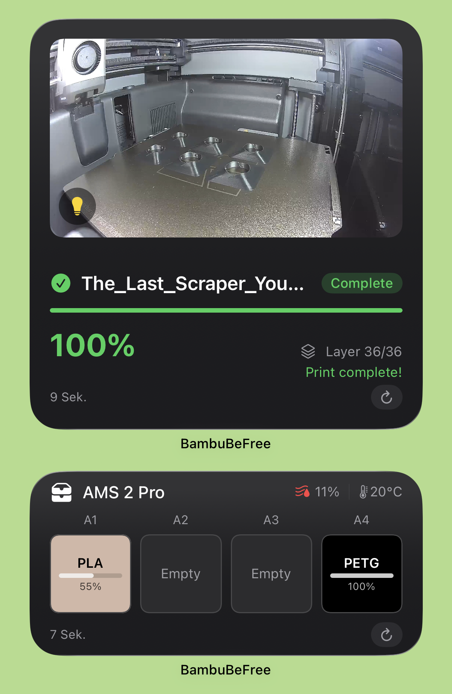

<p align="center">
  
</p>

<h1 align="center">PandaBeFree</h1>

<p align="center">
  A free, open-source 3D printer dashboard for iOS.<br>
  Connects directly to your Bambu Lab printer via MQTT on your local network — no cloud, no server, no subscription.
</p>

<p align="center">
  <a href="https://testflight.apple.com/join/Tb7w9szg">
    
  </a>
</p>

<p align="center">
  <a href="https://github.com/MiguelSchulz/panda-be-free/actions/workflows/ci.yml">
    
  </a>
  &nbsp;
  
  &nbsp;
  
  &nbsp;
  
  &nbsp;
  <a href="https://github.com/sponsors/MiguelSchulz">
    
  </a>
</p>

---

<p align="center">
  
  &nbsp;
  
  &nbsp;
  
  &nbsp;
  
</p>

---

## Features

- **Live Dashboard** — real-time print progress, temperatures, fan speeds, layer info, and ETA
- **Camera Streaming** — live camera feed with fullscreen and zoom support
- **AMS Monitoring** — filament status, colors, material types, and drying control
- **Printer Controls** — pause, resume, stop, speed profiles, light toggle, temperature adjustment, fan control, and airduct mode
- **Home Screen Widgets** — camera snapshot, print progress, and AMS status at a glance
- **Fully Local** — your data never leaves your network
- **Notifications** — the app estimated when your print or AMS drying finishes and schedules a notification. Having at least one widget on the homescreen can greatly improve the accuracy of notifications, as they provide additonal background computing time
- **Localized** — available in English and German

## Requirements

- **iPhone** with iOS 18+
- **Bambu Lab printer** on the same local network

---

## Notifications

PandaBeFree supports local push notifications to let you know when your print or AMS drying finishes. Since the app connects directly to your printer over LAN (no server involved), these notifications are **estimated locally** rather than pushed from a backend.

Here's how it works:

- The app calculates the estimated completion time based on the latest data from your printer and schedules a local notification.
- Every time the app gets a chance to run — when you open it, when a widget refreshes in the background, etc. — it updates the estimate to keep it as accurate as possible.
- **Adding at least one Home Screen widget** can significantly improve notification reliability, as widgets give iOS more reasons to grant the app background execution time for updating estimates.

Because iOS doesn't allow apps to maintain persistent background connections (like MQTT), the app can't continuously listen for real-time printer updates. This means notifications may occasionally be slightly early or late depending on how recently the app was able to refresh. Widgets help bridge this gap.

### Why not remote push notifications or Live Activities?

Both remote push notifications and Live Activities require Apple Push Notification service (APNs) — a server-to-Apple-to-device pipeline where a backend pushes updates through Apple's servers to your phone. The server authenticates using a `.p8` key tied to the developer's Apple Developer account, which is a secret that cannot be shared or published.

For a LAN-connected printer, there's no good way to add a server:

- A **centralized server** would need access to each user's local network and printer credentials — breaking the local-only model.
- A **self-hosted server** solves LAN access but can't send APNs notifications without the developer's `.p8` key.

Until there's a way around these constraints, remote push notifications and Live Activities aren't feasible without server infrastructure that conflicts with the local-only, open-source model.

---

## Upcoming

- **Multi-printer support** — monitor and control multiple printers from a single dashboard
- **Broader printer testing** — currently developed and tested on a **P2S** only. Other Bambu Lab models should work but haven't been verified — feedback from owners of other printers is very welcome
- **Android** — if there's enough interest from the community

---

## Support

PandaBeFree is a lot of fun, but also a lot of work. If you enjoy using it, please consider sponsoring the project. This helps a lot to cover costs like Apple Developer Membership, LLM Tokens for faster development, coffee to keep me running, and filament😉

[](https://github.com/sponsors/MiguelSchulz)

---

## Building from Source

1. Clone the repository:
   ```bash
   git clone https://github.com/miguelschulz/PandaBeFree.git
   cd PandaBeFree
   ```

2. Open the Xcode project:
   ```bash
   open PandaBeFree.xcodeproj
   ```

3. Set up signing — copy the example config and fill in your Team ID and bundle identifier:
   ```bash
   cp Configuration/LocalSigning.xcconfig.example Configuration/LocalSigning.xcconfig
   ```
   Edit `LocalSigning.xcconfig` with your values. This file is gitignored.

4. Build and run on your iPhone.

5. Follow the in-app onboarding to enter your printer's IP address and access code (found on the printer's touchscreen under Network settings).

---


## License

MIT — see [LICENSE](LICENSE) for details.

